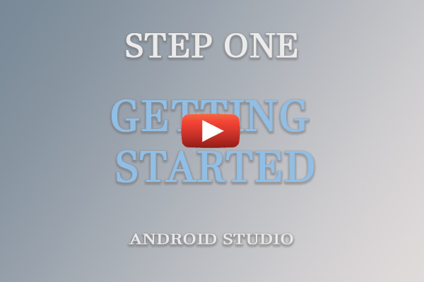
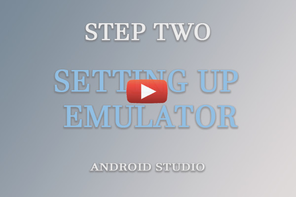

# Transico - (How to run this project) School Project not for Production
Please note that this is a markdown file and as such you would need a markdown reader to have a better experience viewing this file. This file can also be viewed in Visual Studio Code and use the preview option. If those options are unavailable please [Click here](https://github.com/kaytalium/Capstone2019)


---
### Group 1: 
- Tajhna McCourtie
- Ovel Heslop
- Ruel Andrews
- Cordel Reid
- Paula Green


## Development Methology

Before the application can be launched one must first understand the methology that was used to create it.

The Transico application was developed in two parts the android mobile version and the web application version. Below each version lists the technology used in its creation.

---
#### Mobile Version Development Tool
---
- Android studio version 3.3.2 https://developer.android.com/studio

In order to run the code you must have the following installed:

- Android Studio (Watch this video to get started )

[](https://www.youtube.com/watch?v=1-k5KMj8IJQ)

Once the program is installed and configured successfully you may open the `transico_mobile project` with android studio but in order to view the code you must create a virtual phone which is an emulator provided by Google.

The video below will show how to perform the setup. 

[](https://www.youtube.com/watch?v=5BdqfvRS_TY)

Once the emulator is up the application will be launched.

`**Please Note` 

The application database is located on the Google cloud platform known as Firebase so in order to see the live data you must be connected to the Internet. 

--- 
 #### Web Version Developoment Tool
---
- Nodejs version 8.12.0 or higher https://nodejs.org/en/download/
- Visual Studio Code version 1.33.1 or higher https://code.visualstudio.com/download
- Git version 2.21.0 or later https://git-scm.com/downloads
- angularjs cli https://cli.angular.io/

Now that the tools are installed and configured you can open bash by right clicking on the project folder and click from the popup `Git Bash Here` this will open what looks like a command prompt window.

```console
    heslop-capstone MINGW64 ~/Documents/Capstone-Group1-Codezero/transico_web
    $ 
```

From here you will type the phrase "code ." at the dollar sign and this will open the Visual Studio Code application and load up the project.

```console
    heslop-capstone MINGW64 ~/Documents/Capstone-Group1-Codezero/transico_web
    $ code .
```

Once Visual Studio Code is up and ready you can go into the terminal to launch the application using the following command below.

```console
    heslop-capstone MINGW64 ~/Documents/Capstone-Group1-Codezero/transico_web
    $ ng serve --open
```

The command above will create a webserver locally and then build the web application deployment code, move said code to the newly created server and then open a webpage to the application from your default browser.

```**Please note```

For best performance please use a Chrome browser. If this is not your default browser then copy and paste the url you got when the browser was launched into Chrome.

Thank you for your time 
Codezero Team

@ codezero.com all rights reversed.


